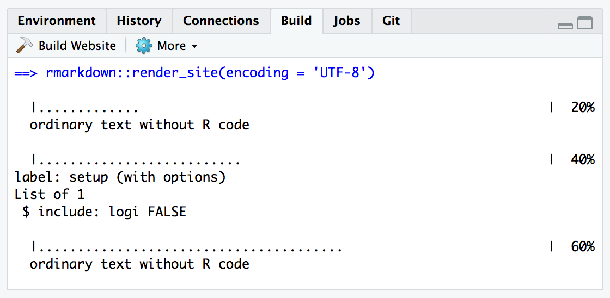
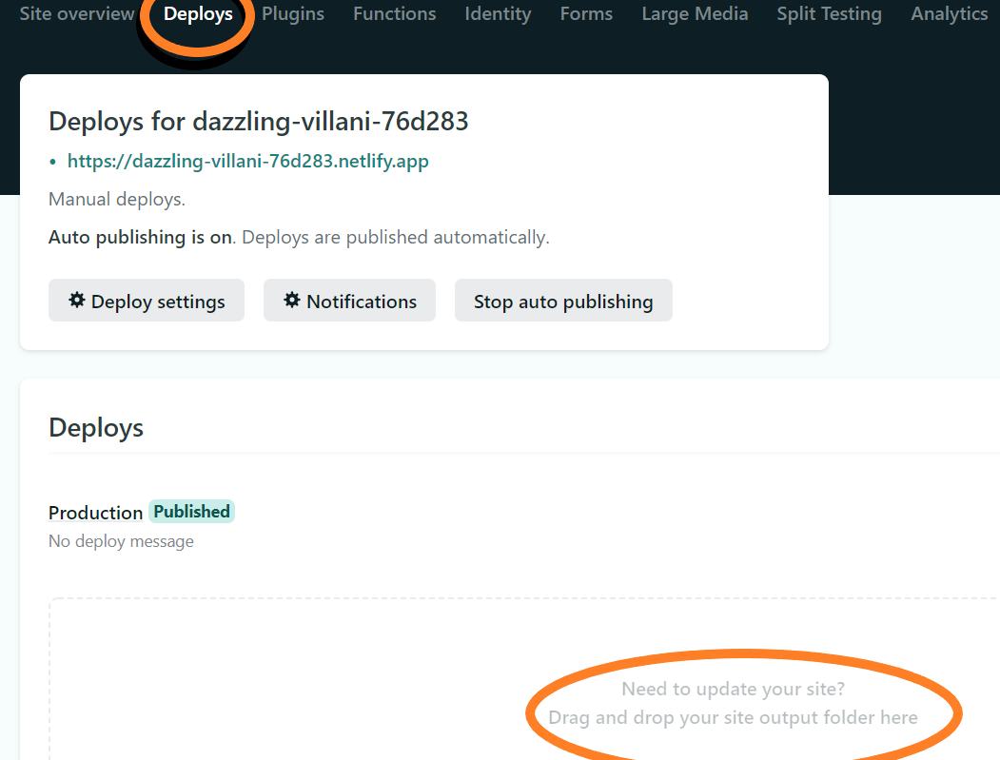
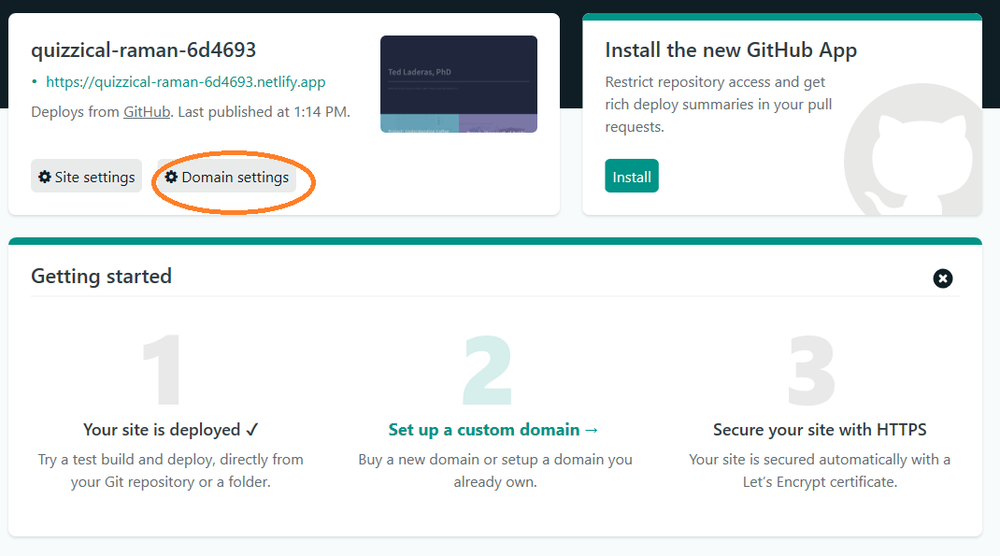

# Workshop on Starting a Distill Website in RStudio

Ted Laderas

This can also be viewed here: https://github.com/laderast/distill_website/README.md

## Learning Objectives

- **Learn** the basic components of a `distill` website
- **Build** and **preview** your website using the *Build* tab
- **Customize** the website with your bio and your picture
- **Add** links and entries to your Navbar Menu
- **Add** knitted html files as article links
- **Get** your website live using Netlify Drop
- **Update** your website by claiming it and registering it
- **Change** your domain name to a better one.


## Before You Start

1. Install R/RStudio Desktop to your Computer.
2. Install the following packages in R:

```
install.packages(c("tidyverse", "postcards", "distill", "usethis"))
```

3. Create a website project in your home directory using `usethis`.

```
usethis::use_course(url="laderast/distill_website",destdir=".")
```

4. Take a look at the website before we get started:

https://distill-example.netlify.app/

5. Gather up the follwing materials:

- Links to Social Media (twitter, linkedin, etc)
- Bio
- Headshot
- Knitted `.html` files you want to share

## Taking a tour of the Project

These are the main files for the project.

- `index.Rmd` - This is the *main* website page.
- `about.Rmd` - This is a nice looking about page built using the `{postcards}` package.
- `image` - A folder. Any images you put in here can be accessed by `image/ted.jpg` in your pages.
- `articles/` - A folder. This is a nice place to park your articles. For right now, it's probably easier to have self-contained articles (single html files)
- `_site.yml` - Customize this to change menus and links
- `_site/` folder - this contains your *rendered* website - you'll drop this folder into Netlify Drop and it will serve it. 

## How does {distill} work?

`{distill}` is what is called a *static* site generator. It takes Markdown and Rmarkdown and converts them to . `.html` files. 

Much like any RMarkdown file, `{distill}` uses `{knitr}` and pandoc to build your website files that are contained in an *RStudio Project*. It knits your `.Rmd` files, converting them to `.html` files to a folder. The default name of this folder is called `_site` and it contains all of them files you need to upload to make a website.

## What is Netlify?

Netlify is what is called a *hosting service*. This is a network of computers called web servers that are accessible via web addresses that will *serve* your website files when they are requested by a web browser.

The amazing thing about Netlify is that it is mostly free and it is very fast, no matter where you are (they have web servers almost everywhere). 

We'll use Netlify Drop to get our website files up and accessible as quickly as possible.

## Customize your about links

Take a look at `about.Rmd` and start filling out the front matter with your own links:

```
links:
  - label: LinkedIn
    url: "https://www.linkedin.com/in/ted-laderas-0714a92/"
  - label: Twitter
    url: "https://twitter.com/tladeras"
  - label: Portfolio
    url: "index.html"
  - label: Email
    url: "mailto:email@email.com"
```

## Adding a photo

Add your photo to the `images` folder. Change the line in `about.Rmd`:

```
image: "image/ted.jpg"
```

to the name of your file. For example, if your file is named `jane.jpg` and you put it in `images`:

```
image: "image/jane.jpg"
```

## Building your website using the Build Tab

In the top right panel in RStudio (next to Environment and History), there is a "Build" Tab. 

Press the `Build Website` to run `knitr`, which will knit your website to the `_site` folder. This is where your *rendered* content lives.



## Previewing your website

- Open the `_site` folder and click on the `index.html` file (make sure you're viewing in web browser)
  - This is your main link to the website (the entry point). For example, if I was hosting my website at https://laderast.github.io/, this would be the first page that I would see. 
- Your `about` page is available as `about.html` in the `_site` folder.
- Click away and make sure that everything works (links in menu, etc). If not, update the `_site.yml` and build it again.


## Try out different `postcards` themes

The `postcards` package has the following built in themes:

- `jolla`
- `jolla_blue`
- `onofre`
- `trestles` - which your current site uses

Change this line in your `about.Rmd` file to the theme of your interest and start building again:

```
output:
  postcards::trestles
```


## Add Your Rendered `.html` files to the `articles/` folder

You can now add your articles to the `articles/` folder.

There are a couple example articles here. Add your own files here.

In general, you'll put **knitted** html articles here. Distill does not rebuild articles, it leaves that up to you.

The relative path to access articles is like this:

`articles/crops.html` 

You'll use this when adding links to your menu.

## Customize the Menu

The menu lives in the `_site.yml` file:


```
navbar:
  right:
    - text: "Home"
      href: index.html
    - text: "About"
      href: about.html
    - text: "Articles"
      menu:
          -  text: "dplyr::slice()"
             href: articles/slice.html
          -  text: "Crop Yields"
             href: articles/crops.html
```

Add another menu entry under articles, or modify the above entries to have a link to your articles.

Build your website again and preview it to make sure the links work.

## Getting Your Website Online

We'll take the `_site` folder with our generated website and drop this entire folder into Netlify Drop.

https://drop.netlify.com

[](http://www.youtube.com/watch?v=-LRlQ_jaLAU "Using Netlify Drop")

## Updating Your Website

The first thing you want to do is claim your site and register for a Netlify account. That ties your newly created website to your account so you can update it.

When you update your website with the `Build Website` button, you'll drag the `_site` folder onto the deploy zone. This is under the `deploy` tab:



[](http://www.youtube.com/watch?v=vywDFg2uIxY "Updating Your Website")


More info here: https://docs.netlify.com/site-deploys/create-deploys/#drag-and-drop

## Customize Your Domain

That crazy name is the address of your site. To change it, you can click on the **Domain Settings** button: 



In the following page, click the **Options >> Edit Site Name** button. You can change the first part of the domain, such as "myportfolio.netlify.app).


## Styling your website

Note that this only applies to the main distill website and not the `about.html`, since that is styled separately.

In `_site.yml`, try uncommenting this line and seeing how the site changes.

```
#theme: theme.css
```

You can modify the appearance of your website by altering the `theme.css` file. Much more info about this here: 

https://rstudio.github.io/distill/website.html#theming


## Creating New Websites

If you want to start from scratch, I highly recommend the Distill tutorial here: 

https://rstudio.github.io/distill/website.html

You may want to setup your webpage as a blog, which lets you add posts by date:

https://rstudio.github.io/distill/blog.html

## Putting your site code on GitHub

This is beyond the scope of this tutorial, but you can put your site code up on GitHub as well. This has the following advantages:

- Lets others contribute to your website
- Can host on GitHub Pages as well
- Lets others reuse your code for their own website

If you're interested in this, I really recommend [Happy Git with R](https://happygitwithr.com/) as a way to get started.

## Acknowledgements

Thank you to RStudio for the `{distill}` package. It is so great!

Portions of this tutorial are adapted from: https://rstudio.github.io/distill/website.html and from https://rstudio.com/resources/webinars/sharing-on-short-notice-how-to-get-your-materials-online-with-r-markdown/


